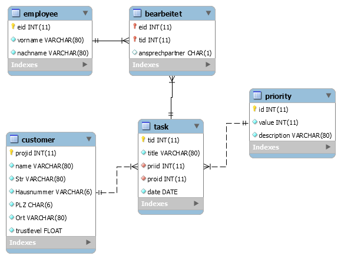

# SELECT Anweisung
## Einfaches Select
1. Geben Sie alle Kunden (**customer**) der Firma aus.
2. Geben Sie alle Aufgaben (**task**) aus, die eine **proid** von 2 hat.
3. Geben Sie die Vornamen aller Mitarbeiter (**employee**) aus, wobei jeder Vorname nur einmal vorkommen darf.
4. Geben Sie die Aufgaben aus, die zwischen den 1.9.2020 und 31.10.2020 erledigt sein sollten.
5. Geben Sie alle Aufgaben und deren Fälligkeitsdatum aus, die das Wort "Web" beinhalten.
6. Geben Sie alle Aufgaben aus, aufsteigend sortiert nach dessen Priorität (hierzu verwenden Sie die **priid**)
7. Geben Sie alle Mitarbeiter der Firma aus, absteigend sortiert nach dem Nachnamen der Mitarbeiter.
8. Geben Sie alle Aufgabe aus, die eine **priid** von 1,3 oder 4 haben.
9. Geben Sie die nächsten 3 fälligen Aufgaben aus.
