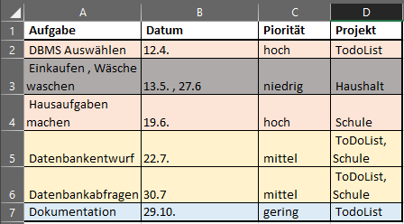
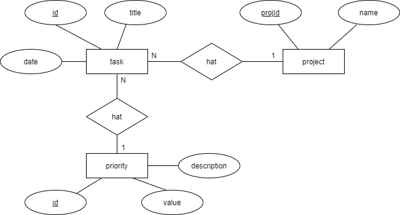
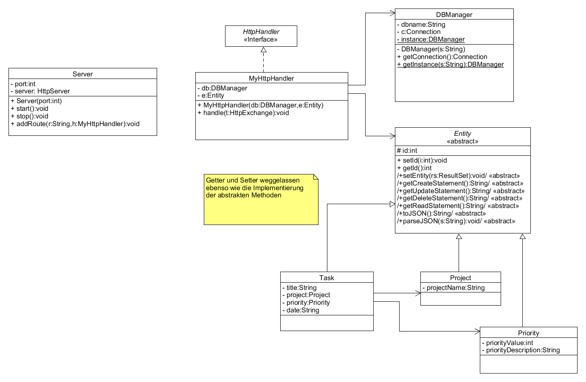
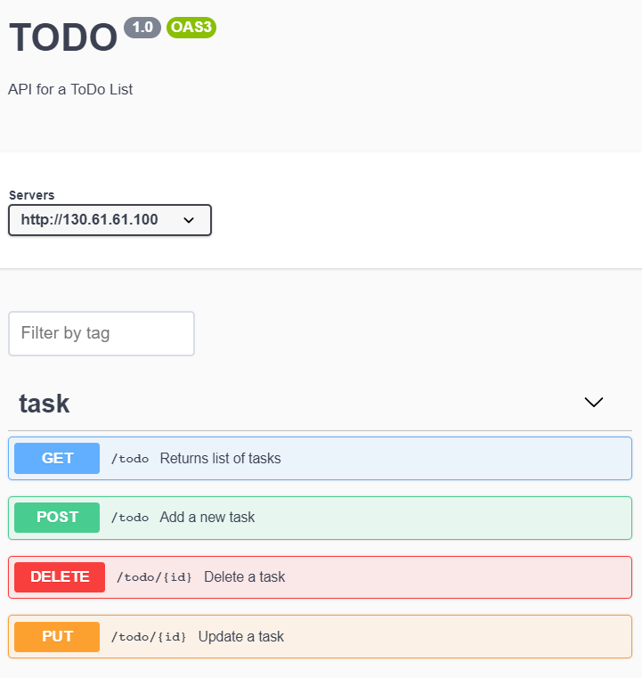
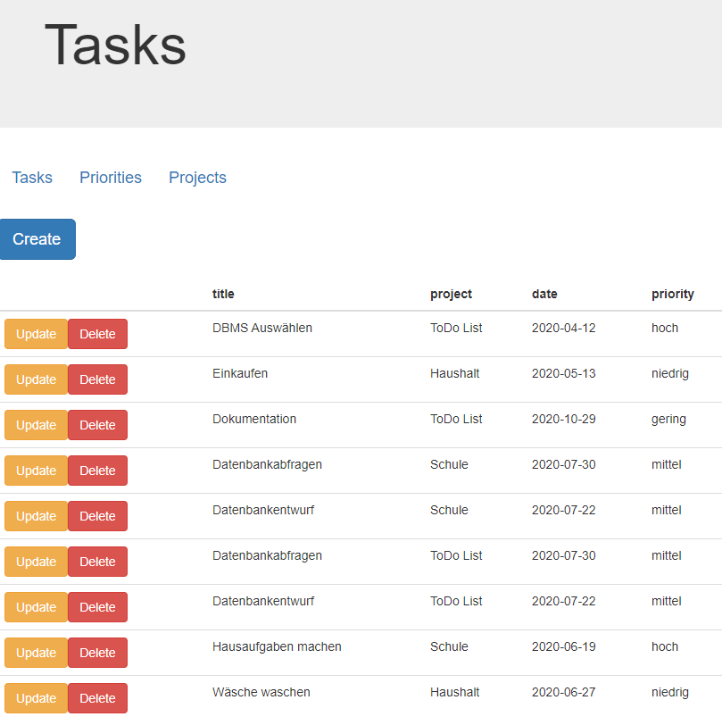
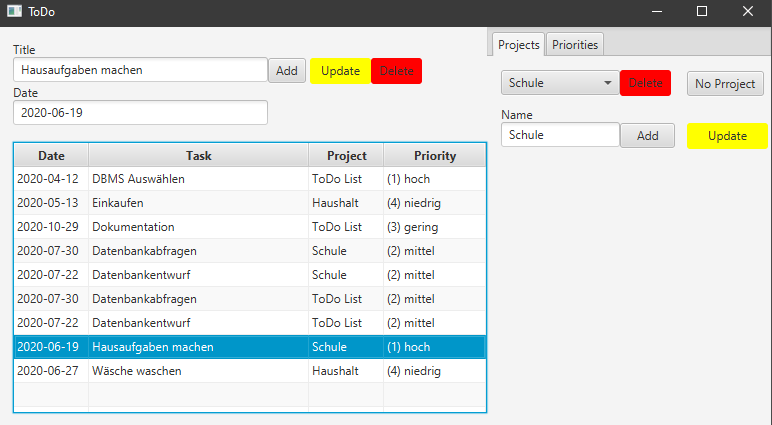

# ToDo Liste
Eine ToDo Liste als REST API für das LF8 LF9 im LF10a. Im 3. AJ hierzu eine GUI entwickelt. Als Datenbank dient eine *SQLite* Datenbank.

Die API wird dokumentiert mittels des *Open API* Standards (ehemals SWAGGER). Die API Dokumentation ist hier zu finden: [swaggerhub](https://app.swaggerhub.com/apis-docs/jtuttas/Todo/1.0.2#/task/get_todo).

[](http://www.youtube.com/watch?v=68GRnO7CqU0)

## Lastenheft
Sie erhalten Sie Aufgabe für die EasyJob GmbH eine Projektverwaltung (ToDo App) zu entwickeln. Die Anwendung sollte er ermöglichen Mitarbeitern diverse Aufgaben (Todo's) zuzuordnen und diese mit Prioritäten zu versehen. Für jede Aufgabe ist ein Ansprechpartner zu benennen. Die Aufgaben sind unterscheidlichen Kunden der Easy Job GmbH zugewiesen. Jeder Kunde besitzt dabei neben einer Adresse auch ein *trustlevel* im Wertebereich von 0 bis 1, der Angibt wie zuverlässig der Kunde bisher war.

Die Daten sollen dabei über verschiedene Endgeräte gepflegt werden können.

Von der Firma erhalten Sie folgende Excel Tabelle, wie diese bisher die Aufgaben verwaltet hat.



Das Produkt soll über eine *CI/CD* als *Docker Container* ausgeliefert werden und in der *Cloud* zur Verfügung stehen.

## Lerninhalte
### LF8: Daten systemübergreifend bereitstellen
**Die Schülerinnen und Schüler besitzen die Kompetenz, Daten aus dezentralen Quellen zusammenzuführen, aufzubereiten und zur weiteren Nutzung zur Verfügung zu stellen**.

Die Schülerinnen und Schüler ermitteln für einen Kundenauftrag **Datenquellen** und **analysieren diese hinsichtlich ihrer Struktur**, rechtlicher Rahmenbedingungen, Zugriffsmöglichkeiten und -mechanismen.

Sie *wählen* die Datenquellen (heterogen) für den Kundenauftrag aus.
Sie entwickeln Konzepte zur Bereitstellung der gewählten Datenquellen für die weitere Verarbeitung unter Beachtung der Informationssicherheit.

Die Schülerinnen und Schüler *implementieren* arbeitsteilig, auch ortsunabhängig, ihr Konzept mit vorhandenen sowie dazu passenden Entwicklungswerkzeugen und Produkten.
Sie *übergeben* ihr Endprodukt mit Dokumentation zur Handhabung, auch in fremder Sprache, an die Kunden.

Sie *reflektieren* die Eignung der eingesetzten Entwicklungswerkzeuge hinsichtlich des arbeitsteiligen Entwicklungsprozesses und die Qualität der Dokumentation.

#### Datenbankentwurf
- DBMS (LF8)
- Entitäten und Attribute (LF8)
- Normalisierung (LF8)
- SQL Datentypen (LF8)
- ER-Diagramm (LF8)
- Relationsschema (LF8)
- DDL
    - CREATE (LF8)
    - Primär / Fremdschlüssel (LF8)
    - Integritätsbedingungen (LF8)



#### Datenbankabfragen
- DML (CRUD) (LF8)
    - INSERT (LF8)
    - SELECT inkl. JOIN (LF8)
    - UPDATE (LF8)
    - DELETE (LF8)

#### Objektorientierung
- Klassen erstellen (LF8)
- Instanzen erzeugen / Klassen verwenden (LF8)
- Vererbung (LF8)
- abstrakte Methoden  (LF8)
- Interfaces (LF8)

#### Dokumentation
- Java Doc (LF8)
- OpenAPI Standard (Swagger) (LF8)

#### UML
- Klassendiagramm (LF8)



### LF9: Netzwerke und Dienste bereitstellen
**Die Schülerinnen und Schüler verfügen über die Kompetenz, Netzwerke und Dienste zu planen, zu konfigurieren und zu erweitern.**

Die Schülerinnen und Schüler ermitteln die Anforderungen an ein Netzwerk in Kommunikation mit den Kunden. Sie *informieren* sich über Eigenschaften, Funktionen und Leistungsmerkmale der Netzwerkkomponenten und Dienste nach Kundenanforderung, auch unter Berücksichtigung sicherheitsrelevanter Merkmale. 

Dabei wenden sie Recherchemethoden an und werten auch fremdsprachliche Quellen aus.

Sie *planen* die erforderlichen Dienste und dafür notwendige Netzwerke sowie deren Infrastruktur unter Berücksichtigung interner und externer Ressourcen.

Dazu *vergleichen* sie Konzepte hinsichtlich ihrer Nachhaltigkeit sowie der technischen und wirtschaftlichen Eignung.

Sie *installieren* und konfigurieren Netzwerke sowie deren Infrastruktur und implementieren Dienste. Sie gewährleisten die Einhaltung von Standards, führen Funktionsprüfungen sowie Messungen durch und erstellen eine Dokumentation.

Die Schülerinnen und Schüler *beurteilen* die Netzwerke sowie deren Infrastruktur und die Dienste hinsichtlich der gestellten Anforderungen, Datensicherheit und Datenschutz.
Sie *reflektieren* ihre Lösung unter Berücksichtigung der Kundenzufriedenheit, Zukunftsfähigkeit und Vorgehensweise.

#### Cloud Computing
- OpenAPI (Swagger) Dokumentation
- CI/CD (LF9)
- HTTP Methoden und REST-API (LF9)
- Cloud VMs (LF9)
- Portfreigaben / Firewall (LF9)
- Docker (LF9)
- Build Tools MAVEN (LF9)



### LF10a: Benutzerschnittstellen gestalten und entwickeln
**Die Schülerinnen und Schüler verfügen über die Kompetenz, Benutzeroberflächen für softwarebasierte Arbeitsabläufe und Geschäftsprozesse zu gestalten und zu entwickeln.**

Die Schülerinnen und Schüler *informieren* sich über die vorhandenen betrieblichen Abläufe und Geschäftsprozesse.

Sie *stellen* diese modellhaft *dar* und leiten Optimierungsmöglichkeiten ab.

Sie *gestalten* und *entwickeln* mit agilen Methoden die Benutzeroberflächen für unterschiedliche Endgeräte und Betriebssysteme und stellen die vollständige Abbildung des Informationsflusses unter Berücksichtigung der Prozessbeschreibung sicher.

Die Schülerinnen und Schüler *stellen* die Funktionalität der Softwarelösung *her* und nutzen hierzu bereits vorhandene Bibliotheken und Module.

Sie *überprüfen* das Produkt auf Datenschutzkonformität und Benutzerfreundlichkeit.

Die Schülerinnen und Schüler *testen* die funktionale Richtigkeit. Sie quantifizieren die Reduktion der Prozesskosten des digitalisierten, optimierten Geschäftsprozesses und stellen
diese den Entwicklungskosten gegenüber.

#### GUI Design
- HTML5 (LF10a)
- JavaFX Client (LF10a)
- Android App (Lf10a)




*ACHTUNG*: Ab Java11 (Open JDK) ist JavaFX nicht mehr enthalten. Das JDK muss nachinstalliert [Link](https://gluonhq.com/products/javafx/) werden und die VMArgs beim Starten richtig gesetzt werden. Wie in Launch.json !

```
{
    "type": "java",
    "name": "JavaFX Client",
    "request": "launch",
    "vmArgs": "--module-path ${workspaceFolder}\\lib\\javafx-sdk-11.0.2\\lib --add-modules javafx.controls,javafx.fxml",
    "mainClass": "todo.fxclient.Main",
    "projectName": "todo" 
},
```

### LF11a: Funktionalität in Anwendungen realisieren

**Die Schülerinnen und Schüler verfügen über die Kompetenz, modulare Komponenten zur informationstechnischen Verarbeitung von Arbeitsabläufen und Geschäftsprozessen zu entwickeln und deren Qualität zu sichern.**

Die Schülerinnen und Schüler *leiten* aus den Informationsobjekten der vorgegebenen Prozessbeschreibungen der Kunden die dazu notwendigen Datenstrukturen und Funktionalitäten ab.


Sie *planen* modulare Softwarekomponenten und beschreiben deren Funktionsweise mit Diagrammen und Modellen.

Sie *wählen* eine Methode zur Softwareentwicklung *aus*. Dabei beachten sie, dass Planung, Realisierung und Tests iterativ in Abstimmung mit den Kunden erfolgen.


Die Schülerinnen und Schüler *realisieren*, auch im Team, die Softwarekomponenten und binden diese an Datenquellen an. Sie dokumentieren die Schnittstellen.


Sie *testen* die erforderliche Funktionalität, indem sie Testfälle formulieren und automatisierte Testverfahren anwenden.
Die Schülerinnen und Schüler *beurteilen* die Funktionalität anhand festgelegter Kriterien
der Kunden und leiten Maßnahmen zur Überarbeitung der erstellten Module ein.

#### Objektorientierung
- Klassenbibliothek verwenden (LF11a)
- Bibliotheken einbinden (LF11a)

#### UML Diagramme
- Verhaltensdiagramme
- Strukturdiagramme

#### Projektmanagement
- Vorgensmodelle / SCRUM (LF11a)
- Netzplan (LF11a)

## Docker Image
Über eine CI/CD Pipeline wird ein Docker Image auf die lokale Registry gepusht. Dieses Image ist wie folgt zu starten:
```
sudo docker run -d -p 80:8000 service.joerg-tuttas.de:5555/root/fiae-ls8_9_10a
```
